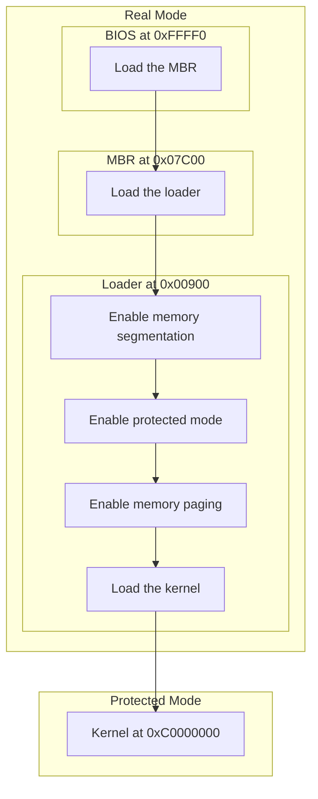
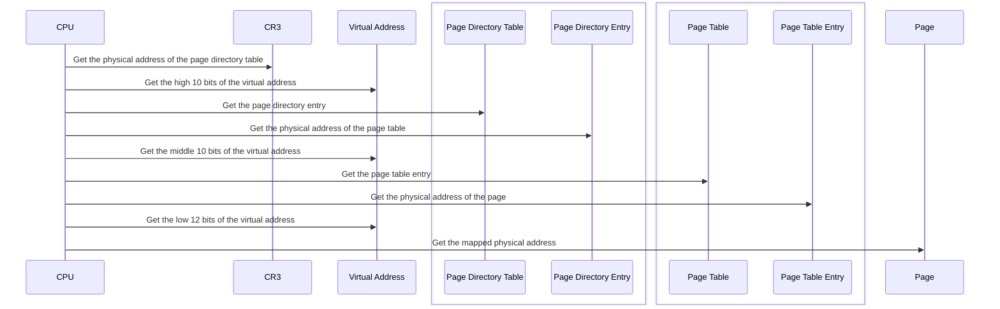

# Loader

After `mbr.bin`, `loader.bin` enables memory segmentation, enters protected mode, enables memory paging and loads the kernel `kernel.bin`.



## Protected Mode

*Protected Mode* is an operational mode of *x86*-compatible central processing units. It allows software to use features such as memory segmentation, virtual memory, memory paging and safe multi-tasking designed to increase an operating system's control over application software.

To enter protected mode, we need the following steps:

1. Enabling the A20 address line.
2. Creating at least three entries in the global descriptor table.
    - A null descriptor indexed `0`.
    - A code segment descriptor.
    - A data segment descriptor.
3. Setting the `PE` bit in the `CR0` register.

### A20 Address Line

The following code enables the A20 line to access larger memory.

```nasm
; src/boot/loader.asm

in      al, a20_ctrl_port
or      al, 0b0010
out     a20_ctrl_port, al
```

### Global Descriptor Table

The *Global Descriptor Table (GDT)* is located at the beginning of `loader.bin` with four descriptors.

| Index |     Name     |       Usage        | Start Address | End Address  |
| :---: | :----------: | :----------------: | :-----------: | :----------: |
|  `0`  |     N/A      | Raising exceptions |      N/A      |     N/A      |
|  `1`  | `code_desc`  |        Code        | `0x00000000`  | `0xFFFFFFFF` |
|  `2`  | `data_desc`  |        Data        | `0x00000000`  | `0xFFFFFFFF` |
|  `3`  | `video_desc` |  VGA text buffer   | `0x000B8000`  | `0x00007FFF` |

We reserve more space with a `times` instruction for new descriptors.

```nasm
; src/boot/loader.asm

section     loader  vstart=loader_base
    ; The Global Descriptor Table
gdt_base:
    ; The first descriptor is unavailable.
    ; It is used to raise an exception if a selector is not initialized.
    dd      0, 0
code_desc:
    dd      0x0000FFFF, desc_code_high_32_bits
data_desc:
    dd      0x0000FFFF, desc_data_high_32_bits
video_desc:
    dd      0x80000007, desc_video_high_32_bits

    times       gdt_count - 4       dq      0
    gdt_size    equ     $ - gdt_base
    gdt_limit   equ     gdt_size - 1
```

After preparing global descriptors, we can load them by a `lgdt` instruction.

```nasm
; src/boot/loader.asm

gdt_reg:
    istruc  DescTabReg
        at DescTabReg.limit,     dw      gdt_limit
        at DescTabReg.base,      dd      gdt_base
    iend
; ...
lgdt    [gdt_reg]
```

If it succeeds, *Bochs* can display these global descriptors with the `info gdt` command.

```console
<bochs:> info gdt 1 3
Global Descriptor Table (base=0xC0000900, limit=2303):
GDT[0x01]=Code segment, base=0x00000000, limit=0xFFFFFFFF, Execute-Only, Non-Conforming, Accessed, 32-bit
GDT[0x02]=Data segment, base=0x00000000, limit=0xFFFFFFFF, Read/Write, Accessed
GDT[0x03]=Data segment, base=0x000B8000, limit=0x00007FFF, Read/Write, Accessed
```

We also need to form selectors with the kernel privilege for them.

```nasm
; include/kernel/selector/sel.inc

sel_code    equ     (1 << 3) + sel_ti_gdt + sel_rpl_0
sel_data    equ     (2 << 3) + sel_ti_gdt + sel_rpl_0
sel_video   equ     (3 << 3) + sel_ti_gdt + sel_rpl_0
```

### Control Register

Finally, we set the `PE` bit in the `CR0` register.

```nasm
; src/boot/loader.asm

mov     eax, cr0
or      eax, cr0_pe
mov     cr0, eax
```

### Flushing Pipelines

To execute 32-bit code in protected mode, we must flush the segment descriptor cache and CPU pipelines with a `jmp` instruction because:

- Subsequent instructions have been incorrectly decoded in 16-bit mode in pipelines.
- The value in the segment descriptor cache is incorrect for 32-bit mode.

```nasm
; src/boot/loader.asm

    ; 16-bit code by default.
    jmp     sel_code:protected_mode
    ; ...
[bits 32]
protected_mode:
    ; ...
```

Note that a `jmp` is still required even if there is no code between `jmp` and the `protected_mode` label.

## Memory Paging

After entering protected mode, memory segmentation is enabled and we can access a larger memory space. However, physical addresses are continuous like linear addresses. In this case, too much memory fragmentation can cause the operating system to be unable to run more processes, even if the total remaining memory is sufficient. To solve this problem, *Memory Paging* can map a linear address to an arbitrary physical address.

### Creating Page Directories

The *Page Directory Table* and *Page Table* are used to store mappings between virtual addresses and physical addresses.

- A page directory table has 1024 page directory entries. Each page directory entry records the physical address of a page table.
- A page table has 1024 page table entries. Each page table entry records the physical address of a memory page.
- A memory page is 0x1000 bytes. So we can access full 4 GB virtual memory.



The following are the steps to convert a virtual address to a physical address:

1. Get the physical address of the page directory table from the `CR3` register.
2. The high 10 bits of the virtual address are the index of the page directory entry. We can get the physical address of the indexed page table.
3. The middle 10 bits the virtual address are the index of the page table entry. We can get the physical address of the indexed memory page.
4. The low 12 bits the virtual address are the offset within the memory page.



In protected mode, each user process has 4 GB virtual memory.

- The low 3 GB memory from `0x00000000` to `0xBFFFFFFF` is for the user. Each user process has different code and data in this memory space.
- The high 1 GB memory from `0xC0000000` to `0xFFFFFFFF` is for the kernel. All user processes share the same kernel code and data.

Our kernel will be loaded into the low 1 MB physical memory from `0x00000000` to `0x000FFFFF`, so the following virtual addresses must be mapped to the physical address `0x00000000`:

- `0xC0000000`, which is the beginning of the high 1 GB kernel memory. The index of its page directory entry is `768`.
- `0x00000000`. Our loader is already running in the low 1 MB physical memory. We must make it works properly after enabling memory paging. The index of its page directory entry is `0`.

A page table can manage 4 MB memory so one table is enough for 1 MB kernel. The page directory entries indexed `0` and `768` point to this page table and it maps the virtual addresses `0x00000000`-`0x003FFFFF` and `0xC0000000`-`0xC03FFFFF` to the physical addresses `0x00000000`-`0x003FFFFF`.

To ensure all user processes share kernel memory, they must use the same page directory entries indexed from `768` to `1022`. We should allocate page tables for them before running the kernel. When a user process is created, these shared page directory entries will be copied to its page directory table.

The last page directory entry indexed `1023` points to the page directory table itself for management.



The page directory table is placed immediately after the kernel image at `0x00100000`. The first page table follows the page directory table at `0x00101000`.

### Control Registers

The `CR3` register should be set to the physical address of the page directory table.

```nasm
; src/boot/loader.asm

mov     eax, page_dir_base
mov     cr3, eax
```

we also set the `PG` bit in the `CR0` register.

```nasm
; src/boot/loader.asm

mov     eax, cr0
or      eax, cr0_pg
mov     cr0, eax
```

Finally, we reload the global descriptor table.

```nasm
; src/boot/loader.asm

lgdt    [gdt_reg]
```

### Flushing Pipelines

As we did when entering protected mode, we flush CPU pipelines. Theoretically it is not needed here.

```nasm
; src/boot/loader.asm

    jmp     sel_code:paging_enabled
paging_enabled:
    ; ...
```

### Checking Address Mapping

After enabling memory paging, we can print address mapping in *Bochs* with `info tab`.

```console
<bochs:> info tab
CR3: 0x000000100000
0x00000000-0x000FFFFF -> 0x000000000000-0x0000000FFFFF
0xC0000000-0xC00FFFFF -> 0x000000000000-0x0000000FFFFF
0xFFC00000-0xFFC00FFF -> 0x000000101000-0x000000101FFF
0xFFFFF000-0xFFFFFFFF -> 0x000000100000-0x000000100FFF
```

- `0x00000000-0x000FFFFF -> 0x000000000000-0x0000000FFFFF` represents the first page directory entry indexed `0` is pointing to the first page table.

- `0xC0000000-0xC00FFFFF -> 0x000000000000-0x0000000FFFFF` represents the page directory entry indexed `768` is also pointing to the first page table.

- In `0xFFC00000-0xFFC00FFF -> 0x000000101000-0x000000101FFF`:

    - The high 10 bits of `0xFFC00000` are `1023`. The last page directory entry indexed `1023` is pointing to the page directory table itself at `0x00100000`. The page directory table is treated as a page table because it is accessed from a page directory entry.

    - The middle 10 bits of `0xFFC00000` are `0`. The first page directory entry indexed `0`, which is pointing to the first page table at `0x00101000`, is treated as a page entry.

  So the virtual address `0xFFC00000` is mapped to the physical address `0x000000101000`. `0xFFC00000` can be used to access page tables. By setting the value of the first 10 bits, we can access different page tables.

- In `0xFFFFF000-0xFFFFFFFF -> 0x000000100000-0x000000100FFF`:

    - The high 10 bits of `0xFFFFF000` are `1023`. The last page directory entry indexed `1023` is pointing to the page directory table itself at `0x00100000`. The page directory table is treated as a page table because it is accessed from a page directory entry.

    - The middle 10 bits of `0xFFFFF000` are `1023`. The last page directory entry indexed `1023`, which is pointing to the page directory table itself at `0x00100000`, is treated as a page entry.

  So the virtual address `0xFFFFF000` is mapped to the physical address `0x000000100000`. `0xFFFFF000` can be used to access the page directory table. By setting the value of the first 10 bits, we can access different page directory entries.

## Loading the Kernel

`kernel.bin` is built in the ELF format. We need to read it from the disk and map each program section to its virtual address. `kernel.bin` does not have address relocation since it is the first module loaded into memory. Also, we have to record the entry point address in the ELF header. When `kernel.bin` is loaded, the CPU will jump to the entry point and run the kernel.

```nasm
; src/boot/loader.asm

    call    LoadKernel
    mov     esp, krnl_stack_top
    call    eax     ; The entry point.
.end:
    jmp     .end
```

The `readelf` command can show information about an ELF file.

```console
$ readelf kernel.bin -l

Elf file type is EXEC (Executable file)
Entry point 0xc0001532
There are 5 program headers, starting at offset 52

Program Headers:
  Type           Offset   VirtAddr   PhysAddr   FileSiz MemSiz  Flg Align
  LOAD           0x000000 0xc0001000 0xc0000000 0x000d4 0x000d4 R   0x1000
  LOAD           0x000500 0xc0001500 0xc0001500 0x0e86c 0x0e86c R E 0x1000
  LOAD           0x00f000 0xc0010000 0xc0010000 0x08bc0 0x08bc0 R   0x1000
  LOAD           0x018000 0xc001a000 0xc001a000 0x002ec 0x01e00 RW  0x1000
  GNU_STACK      0x000000 0x00000000 0x00000000 0x00000 0x00000 RWE 0x10

 Section to Segment mapping:
  Segment Sections...
   00
   01     .text
   02     .rodata .eh_frame
   03     .data .bss
   04
```