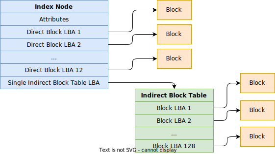
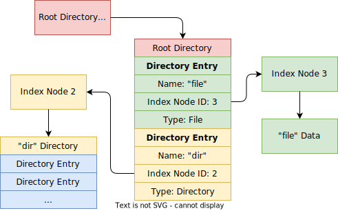
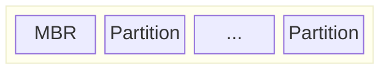
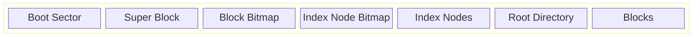

# File System

## Index Nodes

In *Linux*, *Index Nodes* describe file system objects such as files or directories. Each index node stores the attributes and disk block locations of the object's data. In our system, an index node `io::fs::IdxNode` has 12 direct blocks (a block is a disk sector) and a single indirect block table, which is one sector large and contains 128 block LBAs. So an index node can save up to

$$
(12 + \frac{512}{4}) \times 512 = 71680
$$

bytes.

## Directory Entries

Index nodes do not indicate their data type. Instead, we use directory entries `io::fs::DirEntry` to determine whether an item is a file or a directory.

## Super Block

The *Super Block* is the "configuration" of a file system. It is created when the file system is created for a disk partition. Its size is 4096 bytes and starts at offset `4096` bytes in a partition, behind the boot sector. The following diagram shows a disk's partitions.

In our system, the internal structure of a partition is:

