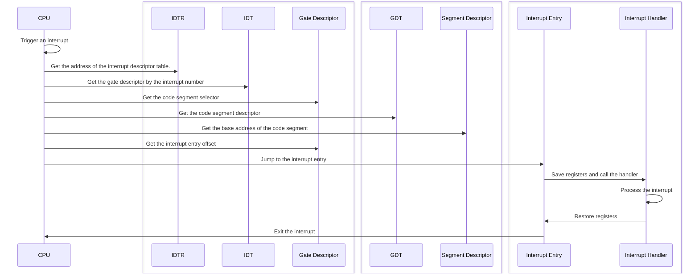
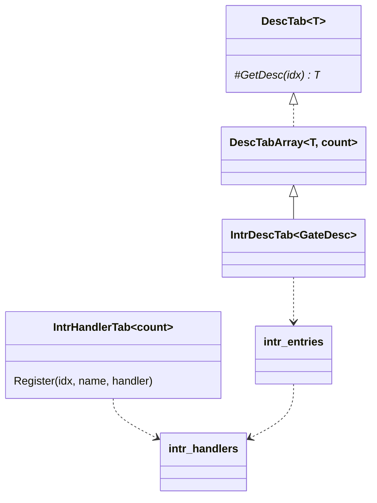

# Interrupts

In *x86* systems, interrupts are managed by the *Interrupt Descriptor Table (IDT)* in protected mode. The entries in the interrupt descriptor table are called *Gates*, including *Interrupt Gates*, *Task Gates* and *Trap Gates*. We only use interrupt gates.

We have two arrays for interrupt entries and handlers:

- `intr::intr_entries` is an array of interrupt entries, which are registered in the interrupt descriptor table.

    ```nasm
    ; src/kernel/interrupt/intr.asm

    intr_entries:
        intr_entry  0x00, zero
        intr_entry  0x01, zero
        intr_entry  0x02, zero
        intr_entry  0x03, zero
        ; ...
    ```

    ```c++
    // src/kernel/interrupt/intr.cpp

    void InitIntrDescTab() noexcept {
        // Register interrupt entries.
        for (stl::size_t i {0}; i != GetIntrDescTab().GetCount(); ++i) {
            GetIntrDescTab()[i] = {sel::krnl_code, intr_entries[i], {desc::SysType::Intr32, Privilege::Zero}};
        }
        // ...
    }
    ```

- `intr::intr_handlers` is an array of interrupt handlers, called from `intr::intr_entries`.

    ```c++
    // src/kernel/interrupt/intr.cpp

    Handler intr_handlers[count] {};
    ```

    ```nasm
    ; src/kernel/interrupt/intr.asm

    Intr%1HandlerEntry:
        ; ...
        ; Call the interrupt handler from the entry.
        push    %1
        call    [intr_handlers + %1 * B(4)]
        ; ...
    ```

When an interrupt `i` occurs, the CPU:

1. Get the address of the interrupt descriptor table `intr::IntrDescTab` from the `IDTR` register.
2. Get the gate descriptor `desc::GateDesc` by the interrupt number `i` in the interrupt descriptor table.
3. Get the code segment selector `sel::Selector` where the interrupt entry is located from the gate descriptor.
4. Get the code segment descriptor `desc::SegDesc` in the global descriptor table `gdt::GlobalDescTab`.
5. Get the base address of the code segment from the segment descriptor.
6. Get the interrupt entry offset from the gate descriptor.
7. Jump to the entry point `intr::intr_entries[i]`.
8. Call the interrupt handler `intr::intr_handlers[i]` after registers are saved.
9. Restore registers and exit the interrupt.



We have two table wrappers for them in `include/kernel/interrupt/intr.h`:

- `intr::IntrDescTab` manages `intr::intr_entries`.
- `intr::IntrHandlerTab` manages `intr::intr_handlers`.

