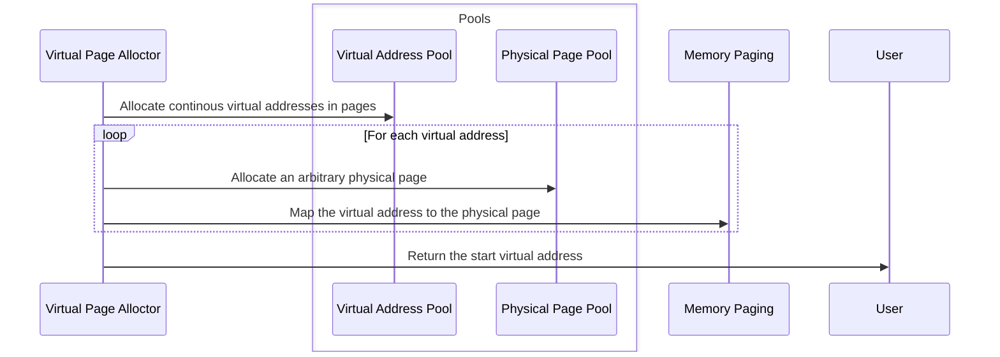
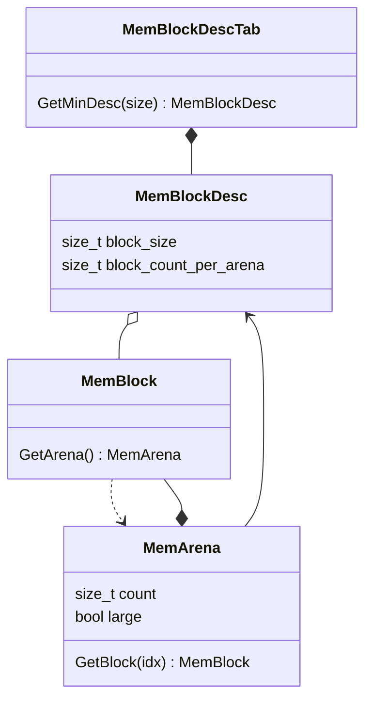
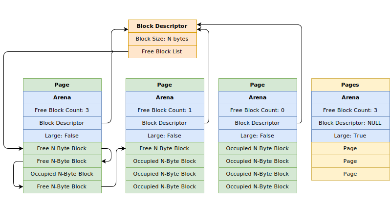
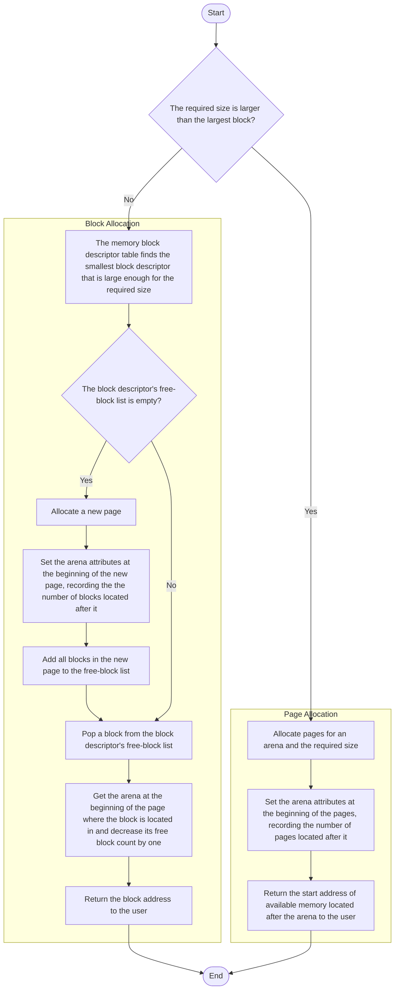
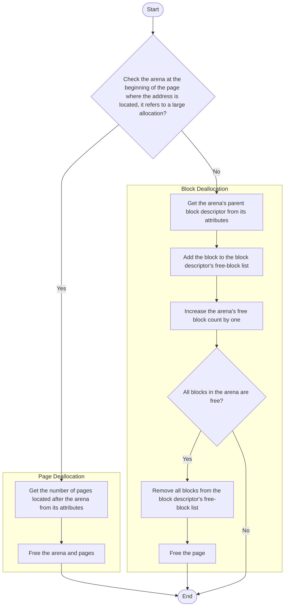

# Memory

## Pages

We use physical page pools `mem::PhyMemPagePool` and virtual address pools `mem::VrAddrPool` to manage virtual memory pages. With memory paging, we can map a virtual address to an arbitrary physical page.

- The system has two physical page pools to manage available kernel pages and user process pages respectively.
- The system has a virtual address pool for the kernel and each user process has its own virtual address pool so each of them can access full 4 GB virtual memory.



### Allocation

`mem::PhyMemPagePool::AllocPages` and `mem::VrAddrPool::AllocPages` can allocate physical pages and virtual addresses respectively, but we have to map virtual addresses to physical pages using `mem::VrAddr::MapToPhyAddr`. For convenience, we can just use `mem::AllocPages` to allocate virtual pages, which is a combination of those steps.

1. Allocate continous virtual addresses in pages using `mem::VrAddrPool::AllocPages`.
2. Allocate arbitrary physical pages using `mem::PhyMemPagePool::AllocPages`.
3. Map each virtual address to an arbitrary physical page using `mem::VrAddr::MapToPhyAddr` by creating a page table entry.
4. Return the start virtual address to the user.



## Heap

We cannot directly use page allocation for small memory blocks, so a heap memory manager is needed for `mem::Allocate` and `mem::Free` using the following structures:



- Each page is divided into a number of small memory blocks (`mem::MemBlock`). They have different sizes from 16 bytes to 1024 bytes. When a user calls `mem::Allocate` and the required size is not larger than 1024 bytes, the address of a block is returned.
- Each type of memory blocks has a memory block descriptor `mem::MemBlockDesc` as a manager. It contains a list of all free blocks of the same size in different pages.
- The memory block descriptor table `mem::MemBlockDescTab` has an array of block descriptors of all sizes. It finds a suitable block descriptor for each allocation request.
- The memory arena `mem::MemArena` is located at the beginning of a page, followed by a number of blocks or pages.
  - If the required size is not larger than 1024 bytes, the arena is a connection between a block descriptor and all blocks in a page. It records the number of free blocks in the current page.
  - Otherwise, the arena records the number of pages located after it.



### Allocation

When a user calls `mem::Allocate`, we check the required size. If the required size is larger than the largest block (1024 bytes), we directly allocate pages for the user.

1. Allocate a number of pages that are large enough for an arena and the required size.
2. Set the arena attributes at the beginning of the allocated pages.
   - `mem::MemArena::large` is `true` and the parent block descriptor `mem::MemArena::desc` is `nullptr` since it manages pages instead of blocks.
   - `mem::MemArena::count` is the number of the allocated pages.
3. Return the start address of available memory located after the arena to the user.

```c++
// src/kernel/memory/pool.cpp

void* Allocate(const PoolType type, const stl::size_t size) noexcept {
    // ...
    if (size > MemBlockDescTab::max_block_size) {
        // Directly allocate a number of pages if the required size is larger than the maximum block size.
        const auto page_count {CalcPageCount(size + sizeof(MemArena))};
        const auto arena {static_cast<MemArena*>(AllocPages(mem_pool, addr_pool, page_count))};
        AssertAlloc(arena);
        arena->desc = nullptr;
        // The arena is a large arena and the count refers to the number of pages instead of blocks.
        arena->large = true;
        arena->count = page_count;
        return reinterpret_cast<stl::byte*>(arena) + sizeof(MemArena);
    }
    // ...
}
```

Otherwise:

1. The memory block descriptor table finds the smallest block descriptor that is large enough for the required size.
2. If the block descriptor's free-block list is empty:
   1. Allocate a new page.
   2. Set the arena attributes at the beginning of the new page.
      - `mem::MemArena::large` is `false` and `mem::MemArena::desc` is the parent block descriptor since it manages blocks instead of pages.
      - `mem::MemArena::count` is the number of free blocks located after the arena in the new page.
   3. Add all blocks in the new page to the free-block list.
3. Pop a block from the block descriptor's free-block list.
4. Get the arena at the beginning of the page where the block is located in and decrease its free block count by one.
5. Return the block address to the user.

```c++
// src/kernel/memory/pool.cpp

void* Allocate(const PoolType type, const stl::size_t size) noexcept {
    // ...
    if (size > MemBlockDescTab::max_block_size) {
        // ...
    } else {
        auto& descs {GetMemBlockDescTab(type)};
        // Get the suitable block descriptor.
        const auto desc {descs.GetMinDesc(size)};
        dbg::Assert(desc);

        if (desc->GetFreeBlockList().IsEmpty()) {
            // Allocate a new arena if the free block list of the descriptor is empty.
            const auto arena {static_cast<MemArena*>(AllocPages(mem_pool, addr_pool))};
            AssertAlloc(arena);
            arena->desc = desc;
            // The arena is not a large arena and the count refers to the number of blocks.
            arena->large = false;
            arena->count = desc->GetBlockCountPerArena();

            // Add all blocks to the free block list.
            const intr::IntrGuard intr_guard;
            for (stl::size_t i {0}; i != arena->count; ++i) {
                auto& block {arena->GetBlock(i)};
                dbg::Assert(!desc->GetFreeBlockList().Find(block.GetTag()));
                desc->GetFreeBlockList().PushBack(block.GetTag());
            }
        }

        dbg::Assert(!desc->GetFreeBlockList().IsEmpty());
        // Remove a block from the free block list and return its address.
        auto& block {MemBlock::GetByTag(desc->GetFreeBlockList().Pop())};
        stl::memset(&block, 0, desc->GetBlockSize());
        auto& arena {block.GetArena()};
        dbg::Assert(arena.count > 0);
        --arena.count;
        return &block;
    }
}
```



### Deallocation

When a user calls `mem::Free` with the virtual address `vr_base`, we get the arena at the beginning of the page where `vr_base` is located in and check `mem::MemArena::large`. If it is `true`, `vr_base` belongs to a large-size allocation, then:

1. Get the number of pages located after the arena from `mem::MemArena::count`.
2. Free the arena and pages.

```c++
void Free(const PoolType type, void* const vr_base) noexcept {
    // ...
    const auto block {reinterpret_cast<MemBlock*>(vr_base)};
    if (auto& arena {block->GetArena()}; arena.large) {
        // Directly free pages if the arena is a large arena.
        dbg::Assert(!arena.desc);
        FreePages(mem_pool, GetVrAddrPool(type), &arena, arena.count);
    }
    // ...
}
```

Otherwise, `vr_base` is a block address.

1. Get its parent block descriptor from `mem::MemArena::desc`.
2. Add the block to the block descriptor's free-block list.
3. Increase the arena's free block count `mem::MemArena::count` by one.
4. If all blocks in the arena are free:
   1. Remove all blocks from the block descriptor's free-block list.
   2. Free the page.

```c++
void Free(const PoolType type, void* const vr_base) noexcept {
    // ...
    const auto block {reinterpret_cast<MemBlock*>(vr_base)};
    if (auto& arena {block->GetArena()}; arena.large) {
        // ...
    } else {
        // Get the block descriptor.
        const auto desc {arena.desc};
        dbg::Assert(desc);
        // Add the block to the free block list of the descriptor.
        desc->GetFreeBlockList().PushBack(block->GetTag());

        // All blocks in the arena are free.
        if (++arena.count == desc->GetBlockCountPerArena()) {
            // Remove all blocks from the free block list.
            for (stl::size_t i {0}; i != arena.count; ++i) {
                auto& block {arena.GetBlock(i)};
                dbg::Assert(desc->GetFreeBlockList().Find(block.GetTag()));
                block.GetTag().Detach();
            }

            // Free the arena.
            FreePages(mem_pool, GetVrAddrPool(type), &arena);
        }
    }
}
```

