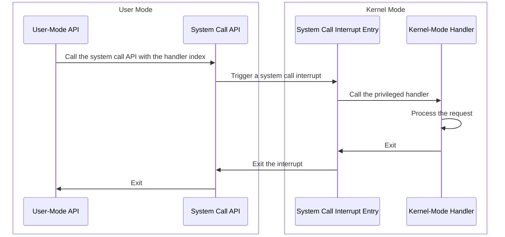

# System Calls

System calls can be used in user mode and trigger a switch to kernel mode to execute privileged code.

## Interrupt Implementation

We use interrupts to implement system calls.

1. Create a table of system call hanlders `sc::sys_call_handlers`. Each handler has an optional argument.

    ```c++
    // src/kernel/syscall/call.cpp

    stl::uintptr_t sys_call_handlers[count] {};
    ```

2. The interrupt number `0x30` is used for system calls.

    ```nasm
    ; src/kernel/syscall/call.asm

    sys_call_intr_num   equ     0x30
    ```

3. Create an interrupt gate in the interrupt descriptor table and register the interrupt entry `SysCallEntry`.

    ```c++
    // src/kernel/interrupt/intr.cpp

    void InitIntrDescTab() noexcept {
        // ...
        const auto sys_call {static_cast<stl::size_t>(Intr::SysCall)};
        GetIntrDescTab()[sys_call] = {sel::krnl_code, intr_entries[sys_call], {desc::SysType::Intr32, Privilege::Three}};
    }
    ```

4. `SysCallEntry` uses `ECX` as an index to call a system call hanlder in `sc::sys_call_handlers` and passes `EAX` as its argument.

    ```nasm
    ; src/kernel/interrupt/intr.asm

    SysCallEntry:
        ; ...
        ; Call a handler.
        push    eax
        call    [sys_call_handlers + ecx * B(4)]
        ; ...
    ```

5. Create a user-mode API `SysCall` which triggers a system call interrupt with a handler index and its argument.

    ```nasm
    ; src/kernel/syscall/call.asm

    SysCall:
        %push   sys_call
        %stacksize  flat
        %arg    func:dword, arg:dword
            enter   B(0), 0
            mov     ecx, [func]
            mov     eax, [arg]
            int     sys_call_intr_num
            leave
            ret
        %pop
    ```

6. For each system call, we can create a user-mode API where `SysCall` is called with a handler index and an optional argument.

    ```c++
    // src/user/process/proc.cpp

    stl::size_t Process::GetCurrPid() noexcept {
        return SysCall(sc::SysCallType::GetCurrPid);
    }
    ```



## Adaptation and Registration

A system call hanlder can only have an optional argument, so for those system calls with multiple arguments, we need to:

1. Create a kernel-mode adapter with only one argument as the system call handler.

    ```c++
    // src/kernel/io/file/file.cpp

    stl::size_t File::Read(const ReadArgs& args) noexcept {
        return io::File {args.desc}.Read(args.buf, args.size);
    }
    ```

2. Register the system call handler to `sc::sys_call_handlers` with `sc::SysCallHandlerTab`.

    ```c++
    // src/kernel/syscall/call.cpp

    void InitSysCall() noexcept {
        GetSysCallHandlerTab()
            .Register(SysCallType::ReadFile,
                    static_cast<stl::size_t (*)(const io::sc::File::ReadArgs&)>(&io::sc::File::Read))
            // ...
    }
    ```

3. Create a user-mode API where multiple arguments are grouped together and passed to `SysCall`.

    ```c++
    // src/user/io/file/file.cpp

    stl::size_t File::Read(const stl::size_t desc, void* const buf, const stl::size_t size) noexcept {
        struct Args {
            stl::size_t desc;
            void* buf;
            stl::size_t size;
        };

        Args args {desc, buf, size};
        return sc::SysCall(sc::SysCallType::ReadFile, reinterpret_cast<void*>(&args));
    }
    ```