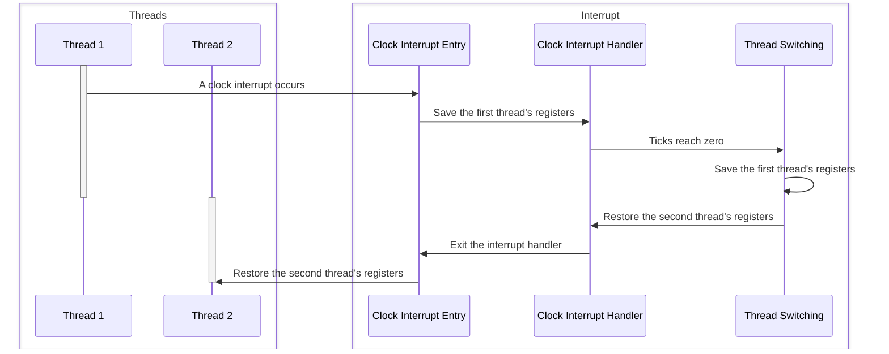
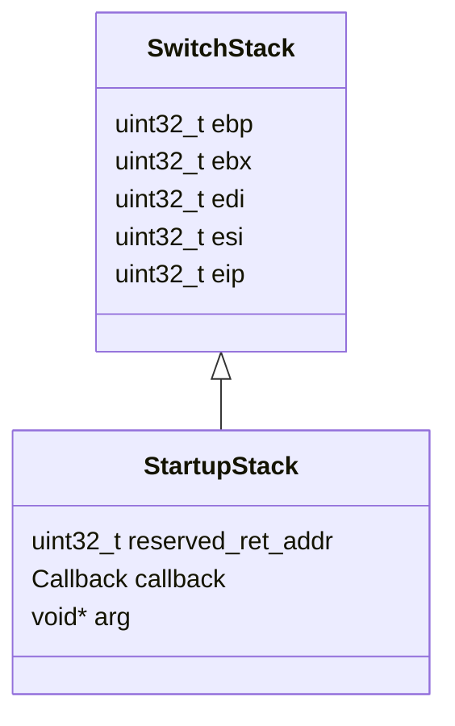

# Threads

The system maintains a block `tsk::thread` for each thread, containing thread information such as status, identity, priority. The size of a thread block is one memory page.



Note that the thread stack used in kernel mode is also in its block, so we add `-O1` to complication flags which can reduce the stack size for local variables. Otherwise threads may have stack overflow errors.

All threads are linked in two lists:

- A list for ready threads `tsk::ThreadLists::ready`.
- A list for all threads `tsk::ThreadLists::all`.



## Scheduling

Thread scheduling is based on clock interrupts and works on a single-core CPU. Each thread has a tick counter and a priority. The execution duration of a thread on a CPU each time is determined by its priority.

1. When starting a thread, its tick counter is equal to its priority.

    ```c++
    // src/kernel/thread/thd.cpp

    Thread& Thread::Init(const stl::string_view name, const stl::size_t priority,
                        Process* const proc) noexcept {
        // ...
        remain_ticks_ = priority;
        // ...
    }
    ```

2. Each time a clock interrupt occurs, its handler reduces the current thread's tick counter by one.

    ```c++
    // src/kernel/thread/thd.cpp

    bool Thread::Tick() noexcept {
        // ...
        if (remain_ticks_ != 0) {
            --remain_ticks_;
            return true;
        } else {
            return false;
        }
    }
    ```

3. When the tick counter reaches zero, the clock interrupt handler calls the thread scheduler.

    ```c++
    // src/kernel/io/timer.cpp

    void ClockIntrHandler(stl::size_t) noexcept {
        // ...
        if (!curr_thd.Tick()) {
            curr_thd.Schedule();
        }
    }
    ```

4. The thread scheduler moves the current thread out of the CPU, resets its tick counter and pushes it at the end of the ready-thread list for the next execution.

    ```c++
    // src/kernel/thread/thd.cpp

    void Thread::Schedule() noexcept {
        // ...
        if (GetStatus() == Status::Running) {
            ResetTicks();
            status_ = Status::Ready;
            GetThreadLists().ready.PushBack(tags_.general);
        }
        // ...
    }
    ```

5. The thread scheduler loads the first thread from the ready-thread list into the CPU.

    ```c++
    // src/kernel/thread/thd.cpp

    void Thread::Schedule() noexcept {
        // ...
        auto& next {GetByTag(GetThreadLists().ready.Pop())};
        next.LoadKrnlEnv();
        next.status_ = Status::Running;
        SwitchThread(*this, next);
    }
    ```

The scheduling algorithm is *First-In, First-Out*. A thread keeps occupying the CPU until it consumes all ticks or it is blocked.

## Switching

Thread scheduling and switching involve two stages of context saving.

1. Thread scheduling occurs in clock interrupts. We need to save registers in `intr::IntrStack` before interrupts.

    ```nasm
    ; src/kernel/interrupt/intr.asm

    Intr%1HandlerEntry:
        ; ...
        push    ds
        push    es
        push    fs
        push    gs
        pushad
        ; ...
    ```

2. In the clock interrupt handler, `tsk::SwitchThread` switches threads. We also need to save registers in `tsk::Thread::SwitchStack` during interrupt handling.

    ```nasm
    ; src/kernel/thread/thd.asm

    SwitchThread:
        push    esi
        push    edi
        push    ebx
        push    ebp
        ; ...
    ```

The following sequence diagram shows the switch from `thread 1` to `thread 2`.



Note that we change the `ESP` register in `tsk::SwitchThread`.

1. When entering `tsk::SwitchThread`, the current stack belongs to `thread 1`, registers and the return address are saved in its stack.
2. `mov esp, [eax + Thread.krnl_stack]` restores `thread 2`'s stack. After that, the current stack belongs to `thread 2`.
3. Registers are restored from `thread 2`'s stack. They were saved when `thread 2` was interrupted last time.
4. When returning from `tsk::SwitchThread`, the return address is also restored from `thread 2`'s stack.
5. `thread 2` continues running from where it was interrupted last time.

```nasm
; src/kernel/thread/thd.asm

SwitchThread:
    ; The stack top is the return address of the current thread.
    ; When it is scheduled next time, it will continue to run from that address.

    ; Save registers into the current thread's stack.
    push    esi
    push    edi
    push    ebx
    push    ebp
    mov     eax, [esp + B(20)]
    mov     [eax + Thread.krnl_stack], esp

    ; Restore registers from the next thread's stack.
    mov     eax, [esp + B(24)]
    mov     esp, [eax + Thread.krnl_stack]
    pop     ebp
    pop     ebx
    pop     edi
    pop     esi
    ; Pop the return address and continue to run the next thread.
    ret
```



## Creation

When a thread is created and scheduled for the first time, it does not have registers for `tsk::SwitchThread` to restore in its stack, and we need it to execute a user-defined entry method. To achieve this, we can prepare a stack `tsk::Thread::StartupStack` containing required data for `tsk::SwitchThread` and use it to start a thread.



1. We create a new thread in `tsk::Thread::Start` where `callback` and `arg` of `tsk::Thread::StartupStack` are set to a user-defined entry method and its argument.

    ```c++
    // src/kernel/thread/thd.cpp

    Thread& Thread::Start(const Callback callback, void* const arg) noexcept {
        auto& startup_stack {GetStartupStack()};
        startup_stack.eip = reinterpret_cast<stl::uint32_t>(StartupCallback);
        startup_stack.callback = callback;
        startup_stack.arg = arg;

        GetThreadLists().ready.PushBack(tags_.general);
        return *this;
    }
    ```

2. `tsk::Thread::StartupStack::eip` is set to the address of `tsk::StartupCallback` which is a utility method for thread startup.

3. After the data preparation, the new thread is added to the thread list for scheduling.

4. When the thread is scheduled for the first time, `tsk::SwitchThread` restores the `EIP` register from `tsk::Thread::StartupStack::eip` as the return address, so `tsk::StartupCallback` is called.

    ```c++
    // src/kernel/thread/thd.cpp

    void StartupCallback(const Thread::Callback callback, void* const arg) noexcept {
        intr::EnableIntr();
        callback(arg);
    }
    ```

5. Currently, the stack top is `tsk::Thread::StartupStack::reserved_ret_addr`. `tsk::StartupCallback` gets its two arguments from `callback` and `arg` of `tsk::Thread::StartupStack` as if it had been called by the `call` instruction. That's why we need `tsk::Thread::StartupStack::reserved_ret_addr`, which acts as a placeholder in a stack.

6. The user-define entry method is called in `tsk::StartupCallback`.