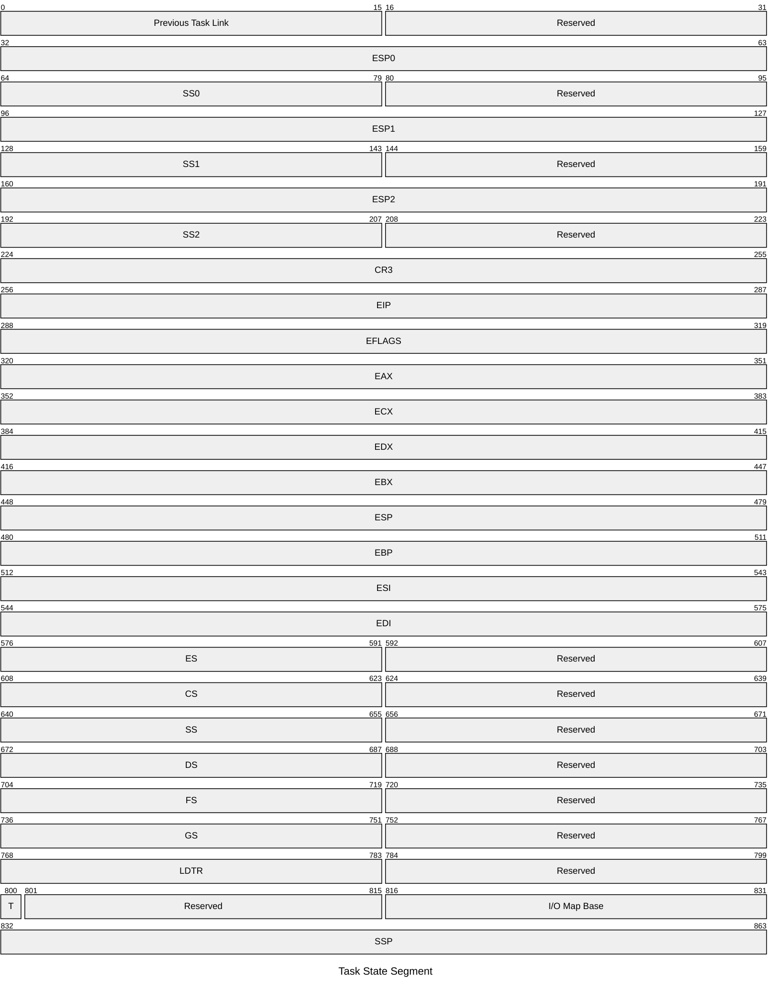

# User Processes

In our system, processes are running in user mode.

## Task State Segment

To support multitasking, CPUs provide two native supports:

- The *Local Descriptor Table* saves data and code.
- The *Task State Segment* saves context state and stack pointers for different privilege levels, etc.

They require that each task is equipped with a local descriptor table and a task state segment. Task switching is switching these two structures. But this approach has low performance.



*Linux* only creates one task state segment for each CPU and all tasks on each CPU share the same task state segment. When switching tasks, it only needs to update `SS0` and `ESP0` in the task state segment to the segment address and pointer of the new task's kernel stack. For example, when an interrupt occurs in user mode, the CPU gets the kernel stack from `SS0` and `ESP0` for interrupt handling. The original task state in user mode are manually saved in the kernel stack using the `push` instruction.

```c++
// src/kernel/process/tss.cpp

TaskStateSeg& GetTaskStateSeg() noexcept {
    static TaskStateSeg tss {.ss0 = sel::krnl_stack, .io_base = sizeof(TaskStateSeg)};
    return tss;
}

TaskStateSeg& TaskStateSeg::Update(const Thread& thd) noexcept {
    esp0 = thd.GetKrnlStackBottom();
    return *this;
}
```

## Creation

When a new process is created, it is in kernel mode. We have to use a fake interrupt to make it enter user mode with an `iret` instruction since the CPU does not allow direct switching from high privilege mode to low privilege mode.

1. Create a thread with the callback `tsk::StartProcess` for the new process as the main thread.
2. When `tsk::StartProcess` is scheduled, it prepares a fake interrupt stack.
   - Use user-mode selectors in segment registers.
   - The return address is set to the process entry.
3. Set `ESP` to the address of the fake interrupt stack.
4. Jump the interrupt exit and return to user mode.

```c++
// src/kernel/process/proc.cpp

Process& Process::Init(const stl::string_view name, void* const code) noexcept {
    // ...
    main_thd_ = &CreateThread(name, default_priority, &StartProcess, code);
    return *this;
}

[[noreturn]] void StartProcess(void* const code) noexcept {
    dbg::Assert(code);
    intr::IntrStack intr_stack {};
    // User processes should use user selectors.
    intr_stack.ds = sel::usr_data;
    intr_stack.es = sel::usr_data;
    intr_stack.fs = sel::usr_data;
    intr_stack.eflags = io::EFlags {}.SetIf();
    intr_stack.old_cs = sel::usr_code;
    intr_stack.old_ss = sel::usr_data;
    // The return address is set to the code entry.
    // When the process returns from the interrupt, it will run this code.
    intr_stack.old_eip = reinterpret_cast<stl::uintptr_t>(code);
    const auto stack {mem::AllocPageAtAddr(mem::PoolType::User, usr_stack_base)};
    mem::AssertAlloc(stack);
    intr_stack.old_esp = reinterpret_cast<stl::uintptr_t>(stack) + mem::page_size;
    JmpToIntrExit(&intr_stack);
}
```

## Fork

### Data Copy

`tsk::Process::Fork` clones a child process from an existing process and run it. The following resources should be copied to the child process:

- The process control block.
- Code and data segments.
- The user and kernel stack.
- The virtual address pool.
- Page tables.

`tsk::Process::CopyMemTo` copies memory to the child process. It iterates over all virtual addresses and for each page that has been allocated:

1. Copy page data to a kernel buffer.
2. Load the child process's page directory table to access its virtual memory.
3. Allocate a page at the same virtual address in the child process.
4. Copy page data from the kernel buffer to the new page of the child process.
5. Load the parent process's page directory table for the following iteration.

```c++
// src/kernel/process/proc.cpp

const Process& Process::CopyMemTo(Process& child, void* const buf,
                                  const stl::size_t buf_size) const noexcept {
    // ...
    for (stl::size_t i {0}; i != vr_addrs_.GetBitmap().GetCapacity(); ++i) {
        // If a virtual memory page is allocated, copy it to the child process.
        if (vr_addrs_.GetBitmap().IsAlloc(i)) {
            // Copy data from the current process to a kernel buffer.
            const auto addr {vr_addrs_.GetStartAddr() + i * mem::page_size};
            stl::memcpy(buf, reinterpret_cast<const void*>(addr), mem::page_size);

            // Load the page directory table of the child process to access its virtual memory.
            child.main_thd_->LoadPageDir();
            // Allocate a memory page at the same virtual address in the child process.
            mem::AllocPageAtAddr(mem::PoolType::User, child.vr_addrs_, addr);

            // Copy data from the kernel buffer to the child process.
            stl::memcpy(reinterpret_cast<void*>(addr), buf, mem::page_size);
            main_thd_->LoadPageDir();
        }
    }
    // ...
}
```

`tsk::Process::CopyFileDescTabTo` clones the file descriptor table to the child process. It simply copies file descriptors and increase their reference count.

```c++
// include/kernel/thread/thd.h

const FileDescTab& Fork() const noexcept {
    auto& file_tab {io::fs::GetFileTab()};
    for (stl::size_t i {io::std_stream_count}; i != descs_.size(); ++i) {
        // If a descriptor refers to an open file, increase its reference count.
        if (const auto desc {descs_[i]}; desc.IsValid()) {
            dbg::Assert(file_tab[desc].IsOpen() && file_tab[desc].GetNode().open_times > 0);
            ++file_tab[desc].GetNode().open_times;
        }
    }
    // ...
}
```

### Return Address

When the parent process calls `tsk::Process::Fork`, it enters kernel mode and the interrupt entry saves its context, including the return address, so the parent process can run the following code after returning from `tsk::Process::Fork`. To make the child process run the same code, we must let it exit from the interrupt like the parent.

After the fork, the child process will be scheduled and restores its return address from `tsk::Thread::SwitchStack` in `tsk::SwitchThread`. We can form a stack for it and `tsk::Thread::SwitchStack::eip` is set to the interrupt exit `tsk::intr_exit`. And `tsk::Process::Fork` should return `nullptr` in the child process, which is `intr::IntrStack::eax`.

```c++
// src/kernel/thread/thd.cpp

Thread& Thread::Fork() const noexcept {
    // ...
    // The child thread should return `0` when exiting the interrupt.
    auto& intr_stack {child->GetIntrStack()};
    intr_stack.eax = reinterpret_cast<stl::uint32_t>(nullptr);

    // When the child thread is scheduled to run,
    // it needs to continue running from the return address of `Fork` as the parent thread.
    // The child thread will start via `SwitchThread`, so we should set its switch stack in advance.
    auto& switch_stack {child->GetSwitchStack()};
    // The return value of `Fork` in the child thread should be `0`,
    // so we have to skip the assignment statement for `EAX`.
    switch_stack.eip = reinterpret_cast<stl::uint32_t>(&intr_exit);
    // `SwitchThread` should restore registers from the switch stack.
    child->krnl_stack_ = static_cast<void*>(&switch_stack);
    // ...
}
```